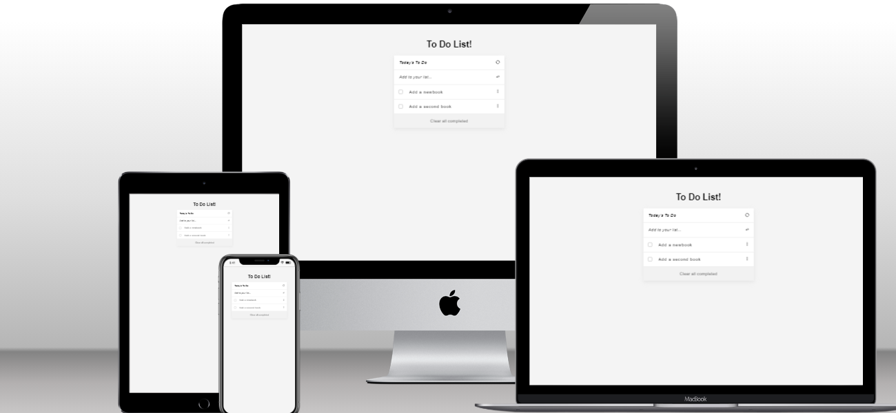

# Todo-List app

> The to do list app is the app that helps people to track what they have to do in a day. With this app,
  you can add a new activity with description, remove it and also check it if it is completed.
  There is a lot more of what someone can do with it.

## Built With

- [x] Languages: HTML, CSS and JavaScript
- [x] Linters: Lighthouse, Webhint, Stylelint and ESlint
- [x] Module Bundler: Webpack
- [x] Module Bundler Loaders: Style, CSS 
- [x] Module Bundler Plugin: HtmlWebpackPlugin
- [x] Code Editor: VS Code


## Website Mockup 📱 💻 🖥️


## Live Demo 🔗

Check out the live demo [here](https://elijahdre.github.io/To-do-List/dist/)👈

## Getting Started

To get a local copy up and running follow these simple steps.

### Prerequisites

- [x] A web browser like Google Chrome.
- [x] A code editor like Visual Studio Code with Git and Node.js.

You can check if Git is installed by running the following command in the terminal.
```
$ git --version
```

Likewise for Node.js and npm for package installation.
```
$ node --version && npm --version
```

### Setup

Clone the repository using the GitHub link provided below.

### Install

In the terminal, go to your file directory and run this command.

```
$ git clone git@github.com:Elijahdre/To-do-List.git
```

### Usage

Kindly modify the files as needed.

### Run tests

To check for linters, use the files provided by [Microverse](https://github.com/microverseinc/linters-config). A GitHub action is also set to run during pull request.
```
$ npm install
```

### Deployment

This app is deployed in the GitHub Pages for easy viewing upon merged on the main branch.
Please find the link in the Live Demo section.l

## Authors

👤 **Elijah Odjegba** 

  - GitHub: [](https://github.com/Elijahdre)
  - Twitter: [](https://twitter.com/kingglijah)
  - LinkedIn: [](https://www.linkedin.com/in/elijah-odjegba)


## 🤝 Contributing

Contributions, issues, and feature requests are welcome!

Feel free to check the [issues page.](https://github.com/Elijahdre/To-do-List/issues)

## Show your support

Give a ⭐️ if you like this project!

## Acknowledgments

- [Microverse](https://www.microverse.org/)
- Code Reviewers
- Coding Partners

## 📝 License

This project is [MIT](./MIT.md) licensed
